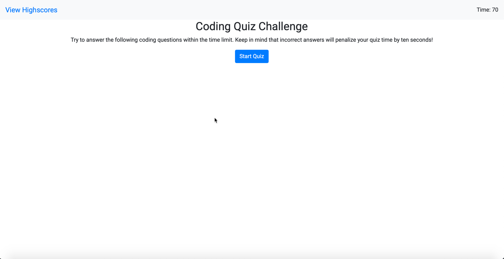

# monash-code-quiz

## About

```
Once you click the 'Start Quiz' button, you will be displayed a question with four multiple choice answers.
A timer will commence counting down from 70 seconds.
As you select your answer, you will move to the next question.
If you get a question correct, you will have 5 points added to your score.
If you get a question wrong, you will have 10 seconds deducted from your time. 
If your time reaches zero seconds before you answer all the questions, the quiz will end and you will be shown your score and have the chance to record your score.
Likewise, if you answer all the questions, you will be shown your score and have the chance to record your score.
```

Play my code quiz now --> [Coding Quiz Challenge](https://darren-behan.github.io/monash-code-quiz/)



## Acceptance Criteria

```
GIVEN I am taking a code quiz
WHEN I click the start button
THEN a timer starts and I am presented with a question
WHEN I answer a question
THEN I am presented with another question
WHEN I answer a question incorrectly
THEN time is subtracted from the clock
WHEN all questions are answered or the timer reaches 0
THEN the game is over
WHEN the game is over
THEN I can save my initials and score
```